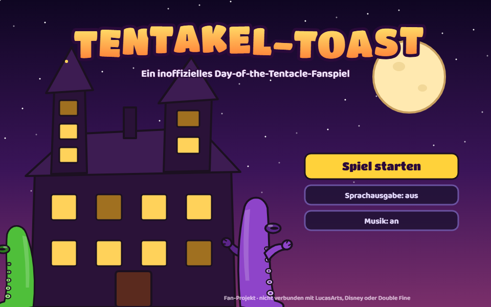
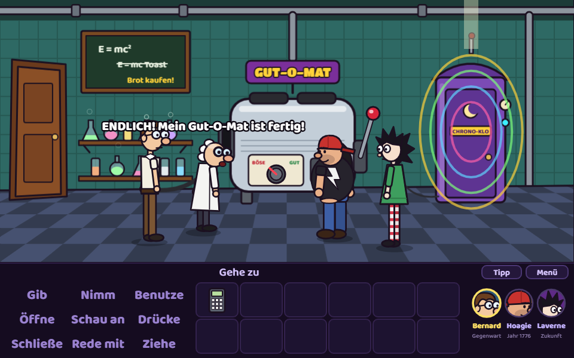
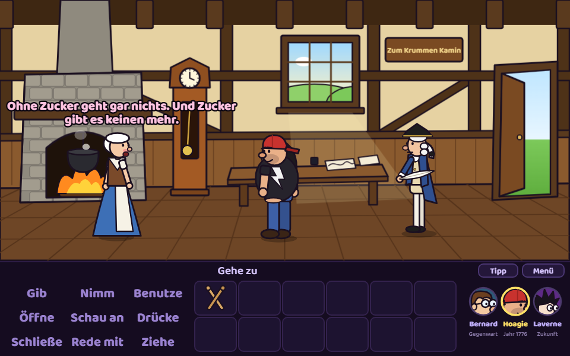
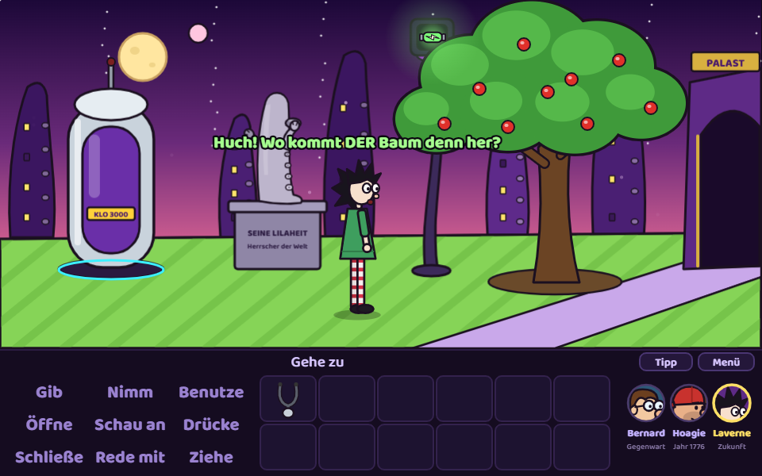
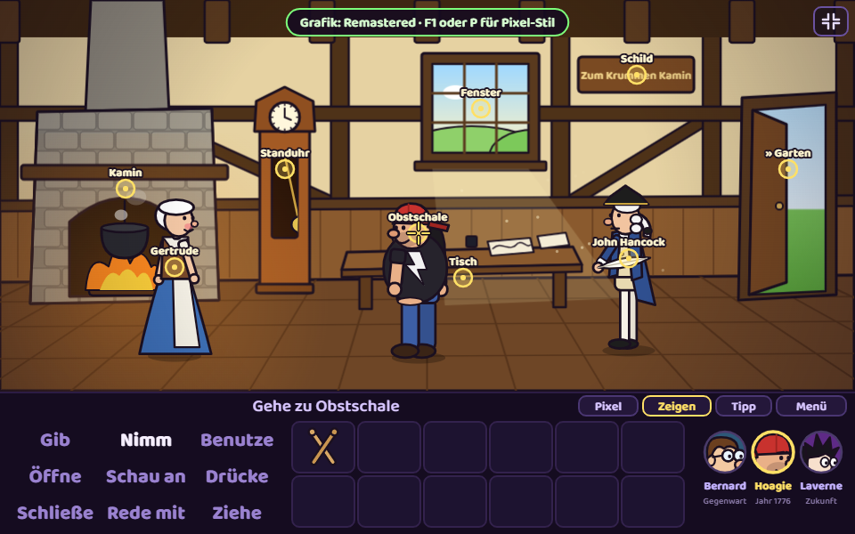
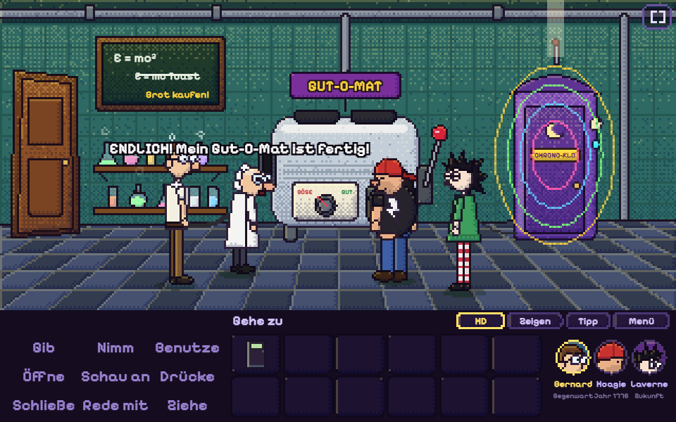
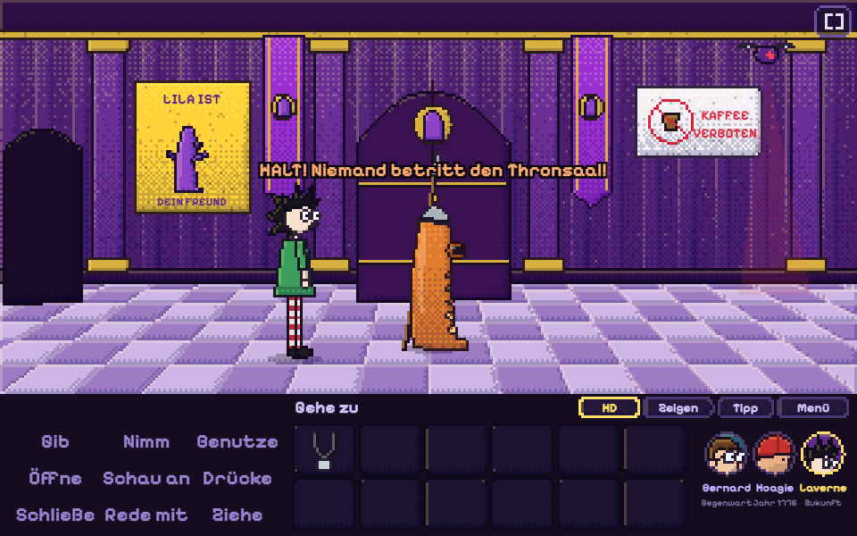

# Tentakel-Toast

**Ein inoffizielles Day-of-the-Tentacle-Fanspiel – direkt im Browser.**

▶ **Jetzt spielen:** https://madd1in.github.io/tentakel-toast/



Fünf Jahre nach dem großen Tentakel-Tag hat Dr. Fred seine größte Erfindung gebaut: den **Gut-O-Mat**. Ein Toast daraus macht selbst den bösesten Schurken lieb und nett. Blöd nur, dass Lila Tentakel durchs Chrono-Klo abgehauen ist, die Energiezelle geklaut und das letzte Freundlichkeits-Brot gefressen hat.

Jetzt müssen **Bernard** (Gegenwart), **Hoagie** (Jahr 1776) und **Laverne** (Zukunft) zusammenarbeiten und sich Gegenstände per Chrono-Klo durch die Zeit schicken.

| Gegenwart | 1776 | Zukunft |
|---|---|---|
|  |  |  |

## Zwei Grafikstile: Remastered und Klassisch

Mit **F1**, **P**, dem Knopf „Pixel“ oder dem rechten Stick am Controller schaltest du jederzeit um – wie in der Remastered-Fassung des Originals. Im klassischen Modus zeichnet ein eigener Software-Renderer jeden Raum, jede Figur und jedes Objekt neu als VGA-Pixel-Art auf 320×200 – im Stil von Simon the Sorcerer und dem Original-DOTT: harte Kanten, Licht von links oben mit Farbrampen (kühle Schatten, warme Lichter), gerasterte Übergänge, gemalte Hintergründe und farbige Konturen. Die Musik klingt dann wie eine alte Soundkarte.

| Remastered | Klassisch |
|---|---|
|  |  |
|  |  |

## Features

- Klassische Verb-Steuerung im Stil der SCUMM-Adventures (Gib, Nimm, Benutze, Öffne, Schau an, Drücke, Schließe, Rede mit, Ziehe)
- 3 spielbare Figuren in 3 Zeitebenen und 7 Räumen, Wechsel mit Zeitstrudel-Effekt
- Zeitreise-Rätsel: Was du 1776 tust, verändert die Zukunft
- Dialogbäume mit Dr. Fred, Grünem Tentakel, Oma Gertrude, John Hancock, der Tentakel-Wache und Lila Tentakel
- **Steuerung mit Maus, Touch, Tastatur oder Xbox-Controller** (auch in Edge auf der Xbox), mit Vibration
- **Vollbild** startet automatisch, auf dem Handy mit Querformat-Sperre
- 10 Erfolge, Fortschrittsanzeige, Statistik am Ende, Hotspot-Anzeige, Tipp-System
- Prozedurale Grafik (Canvas 2D) und Musik (WebAudio-Synthesizer) mit eigenen Themen pro Zeitalter, Umgebungsgeräuschen, Schritten je nach Boden und Plapperstimmen pro Figur
- Lebendige Szene: Laufstaub je nach Untergrund, weiche Schatten unter Möbeln, Lichtstimmung pro Raum und sanftes Klick-Feedback
- **Gemalter HD-Look:** Jede Fläche bekommt automatisch einen Licht-Verlauf, Konturen sind fein und farbig statt schwarz, Raumhintergründe bekommen weiches Leuchten, Licht-Verlauf und Maltextur
- **HD-Licht:** Figuren bekommen pro Raum eine Licht- und Schattenseite mit Randlicht, dazu Bloom auf hellen Stellen, Kaminflackern, flackernde Laborröhren und ein Gewitter über Lilas Palast – im Zukunftsgarten regnet es sichtbar in Schauern – mit Donner, Aufprall-Spritzern und natschplatschenden Schritten, während sich die Glühwürmchen verstecken
- Schwebeteilchen pro Raum: Staub im Lampenlicht, fallendes Herbstlaub 1776, Glühwürmchen im Zukunftsgarten (sie weichen dir aus), magische Funken im Palast
- Raumklang: eigener Hall pro Raum (vom trockenen Garten bis zum hallenden Thronsaal), Schritte und Stimmen im Stereo-Panorama
- NPCs murmeln nebenbei vor sich hin, und wer zu lange herumsteht, bekommt einen Spruch von der eigenen Figur
- Spiegelungen auf Fliesen und Marmor, leichtes Atmen im Stand, Dialog-Kamera, die bei Gesprächen sanft heranzoomt, Funkenregen beim Aufheben, Gräser im Vordergrund der Gärten, neues Titelbild mit Hügel-Ebenen, Nebel, leuchtender Villa, Fledermäusen und den drei Helden im Mondlicht
- **Neue Musik:** Tavernen-Gigue im Gasthaus 1776, Bossa-Lounge in der Lobby, neue Instrumente (Streicher, Blech, E-Piano, Laute, Fiedel), Schlagzeug mit Hi-Hats, Klatschen und Bodhrán, Instrumente im Stereo-Bild verteilt, Kompressor auf der Summe
- **Musikbox** im Menü (Extras): alle Stücke anhören
- **Minispiel „Gut-O-Mat“** (Menü → Extras): Toast-Timing in fünf Runden – die Nadel im goldbraunen Bereich stoppen, Dr. Fred kommentiert, Rekord und Erfolg „Toast-Meister“
- **Kapitel-Titelkarten** mit Kinobalken und Fanfare nach jedem gelösten Rätsel; im Titelbild saust ab und zu das Chrono-Klo über den Himmel
- Einstellung **Hotspot-Hilfe**: dezente, pulsierende Markierungen an allem Benutzbaren; das gewählte Verb leuchtet in der Satzzeile
- **Minispiel „Tentakel-Rock“** (Menü → Extras): mit dem Grünen Tentakel die Lead-Gitarre im Takt spielen – drei Bahnen, drei Schwierigkeitsgrade mit Bestenliste, Kombos, eigener Rock-Song mit verzerrter Gitarre und ein Erfolg ab 80 % Treffern
- **Plapperstimmen mit Vokal-Formanten:** Kauderwelsch statt Piepsen, jede Figur mit eigener Klangfarbe
- **Großes Finale:** Feuerwerk, Konfetti, alle Figuren auf dem Hügel, Abspann und eine größere Abspannmusik
- Lebendige Porträts und Figuren (blinzeln, reden mit, die Pupillen folgen dem Zeiger) und versteckte Gags auf dem Titelbildschirm
- **Adaptive Musik:** Mit jedem gelösten Rätsel kommen neue Instrumente dazu; jede Figur hat ein kurzes Erkennungsmotiv beim Gesprächsbeginn; im Pausenmenü klingt alles gedämpft
- **Chrono-Kristalle:** In sechs Räumen liegt je ein Kristall versteckt – wer alle findet, bekommt einen Erfolg
- **Foto-Taste** (O oder F2): speichert das aktuelle Bild als PNG und legt es im **Fotoalbum** (Menü → Extras) ab
- **Bessere Figuren-Animation:** Knie und Ellbogen beugen sich im Gangzyklus, der Oberkörper neigt sich beim Laufen, Figuren gestikulieren und nicken beim Reden, Richtungswechsel mit kurzer Drehung; Laverne klettert im Zukunftsgarten in echter Kletterpose (Arme und Beine greifen abwechselnd, Blätter rascheln und rieseln)
- **Aktions-Posen:** Figuren greifen nach Dingen, gehen zum Aufheben in die Hocke (Füße bleiben am Boden), graben mit Erdbröseln, beißen kauend in den Apfel, ziehen am Brunnenseil, gießen mit Wasserspritzern und reißen am Hebel
- Kleine Gesten im Stand: Bernard schiebt die Brille hoch, Hoagie trommelt Luftschlagzeug, Laverne winkt, Dr. Fred reibt sich das Kinn
- Schrittzähler im Notizbuch und im Abspann; wer dasselbe Ding zu oft anschaut, bekommt einen genervten Spruch
- Neue Musik: komischer Marsch „Wachparade“ im Palast-Vorraum
- Automatisch adaptive Qualität: Bei ruckelnder Bildrate reduziert das Spiel Auflösung und Effekte von selbst – und schaltet hoch, wenn wieder Luft ist
- Einstellbare Textgeschwindigkeit (langsam, normal, schnell); Gegenstände im Inventar heben sich beim Überfahren und leuchten
- Optionale Sprachausgabe über die Browser-Stimmen (Web Speech API): natürliche Stimmen bevorzugt, eigene Stimme und Tonlage pro Figur
- **Doppelklick zum Rennen**, Ausgänge per Doppelklick sofort benutzen
- **Sichtbare Zeitreise-Post:** Das Klo leuchtet als Zeitportal auf, der Gegenstand fliegt mit Leuchtspur zum Porträt des Empfängers; beim Figurenwechsel rast ein Sterntunnel vorbei
- **Klo-Post von überall:** Taste K, Knopf „Klo-Post“ oder linker Stick – die Figur springt kurz zum Klo ihrer Zeit und wieder zurück
- **Speichern & Laden:** Autosave plus 3 Speicherplätze, Export/Import als Datei; Notizbuch mit erledigten Aufgaben

## Steuerung

| Aktion | Maus / Tastatur | Touch | Xbox-Controller |
|---|---|---|---|
| Zeiger bewegen | Maus · Pfeiltasten springen | – | Linker Stick · Steuerkreuz springt |
| Aktion | Klick · Enter | Tippen | A |
| Standard-Aktion | Rechtsklick | Lange drücken | X |
| Zurück / Text überspringen | Esc · Punkt | Tippen | B |
| Verb wählen | Klick · G N B O S D C R Z | Tippen | LT / RT |
| Figur wechseln | Gesichter · 1–3 | Gesichter | LB / RB |
| Hotspots zeigen | Tab · Leertaste | „Zeigen“ | Ansicht |
| Tipp | H · „Tipp“ | „Tipp“ | Y |
| Rennen / Ausgang sofort | Doppelklick | Doppeltippen | A zweimal |
| Klo-Post | K · „Klo-Post“ | „Klo-Post“ | Linker Stick |
| Pixel-Grafik | F1 · P | „Pixel“ | Rechter Stick |
| Vollbild | F | Symbol oben rechts | – |
| Foto | O · F2 | – | – |
| Menü | Esc | „Menü“ | Menü |

Gegenstände schickst du per Chrono-Klo durch die Zeit: **Gib** → Gegenstand → Gesicht unten rechts. Das klappt von überall – die Figur läuft kurz zum Klo und kommt zurück.

<details>
<summary><strong>Komplettlösung (Spoiler!)</strong></summary>

1. **Bernard:** In der Lobby die Zuckerdose nehmen, das Sofa durchsuchen (Münze), Münze in den Kaffeeautomaten.
2. **Bernard:** Im Labor den Würfelzucker an Hoagie und den Kaffee an Laverne schicken.
3. **Hoagie:** Gertrude den Zucker geben, sie backt das Freundlichkeits-Brot. Apfel aus der Schale nehmen und essen.
4. **Hoagie:** Im Garten die Schaufel nehmen, ein Loch ins Beet graben, Apfelbutzen pflanzen, Eimer am Brunnen füllen und gießen.
5. **Hoagie:** Das Brot vom Plumpsklo an Bernard schicken.
6. **Laverne:** Auf den neuen Apfelbaum klettern, Energiezelle holen und an Bernard schicken. Der Wache im Palast den Kaffee geben.
7. **Bernard:** Energiezelle und Brot in den Gut-O-Mat, Regler auf GUT drehen, Hebel ziehen, Toast an Laverne schicken.
8. **Laverne:** Im Thronsaal Lila den Toast geben.

Bonus: Hoagie kann seine Drumsticks 1776 in die Standuhr legen. Bernard findet sie in der Gegenwart – und der Grüne Tentakel weiß, was man damit macht.
</details>

## Technik

Reines HTML5 + JavaScript ohne Build-Schritt und ohne Abhängigkeiten (nur Google Fonts).

```
index.html      Einstieg
js/draw.js      Zeichenhelfer, Figuren, Inventar-Icons
js/pixel.js     Pixel-Renderer für den Klassik-Modus (Software-Rasterizer mit Canvas-API)
js/audio.js     WebAudio-Musik, Effekte, Umgebung, Schritte, Plapperstimmen, Sprachausgabe
js/rooms.js     Räume, Hintergründe, Hotspots, Effekte
js/engine.js    Verben, Laufen, Dialoge, Zeitreise-Post, Eingabe (Maus/Touch/Controller), Vollbild, Erfolge, Speichern, Rendering
js/story.js     Figuren, Gegenstände, Rätsel, Dialoge, Zwischensequenzen
```

Lokal starten:

```bash
python -m http.server 8000
```

Dann http://localhost:8000 öffnen.

## Rechtliches

Fan-Projekt ohne kommerzielle Absicht. Nicht verbunden mit LucasArts, Disney oder Double Fine. *Day of the Tentacle* und die Figuren sind Eigentum der jeweiligen Rechteinhaber. Geschichte, Rätsel, Dialoge, Code, Grafik und Musik dieses Spiels sind neu geschrieben; es werden keine Original-Assets verwendet.

Der Quellcode steht unter der MIT-Lizenz (siehe `LICENSE`).
